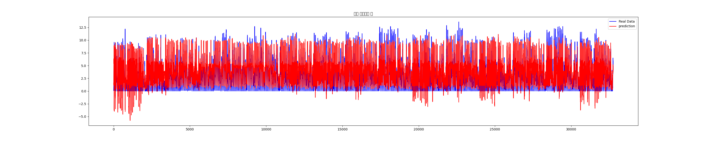

# 🌈 Ultraviolet-Prediction-Model
> 기상청에서 주최하는 『2022 날씨 빅데이터 콘테스트』 대회에 참가하여, 딥러닝 모델을 학습시킨 과정들을 기록한 저장소입니다.

# 발표 자료 링크 
https://drive.google.com/file/d/1ptDdVQKkXrHAkt54jeWA5Yf0tJvIAvNM/view?usp=drive_link

# 🙋‍♀️ 참가
- 소프트웨어 및 시스템 보안 연구실 내 석,박사 과정 각 1명과, 학부생 2명(필자)으로 참가했다. <br>
# ⛅️ 소개 
- ## 주제 : 기상위성 자료를 활용한 여름철 자외선 산출 기술 개발
- #### 날씨 빅데이터와 딥러닝 모델을 활용하여 자외선 수치 예측해보기로 했다.

# 🏆 대회 진행 과정 
_대회를 진행하면서 전 과정들을 "[notion](https://www.notion.so/a315e332914c473eb5f45651a1346eea)"에 기록해두었습니다._
> #### 일정 
> - 참가신청 : 2022.05.30 (~ 06.08 연장)
> - 1차 미팅 : 2022.05.31(월) 13시
> - 2차 미팅 : 2022.06.20(월) 13시
> - 3차 미팅 : 2022.06.27(월) 13시
> - 4차 미팅 : 2022.07.04(월) 13시
> - 1차 대회 제출 : 2022.07.18(월) <br>
>   ( ~ 08.01(월) 17:00 연장 -> 08.03(수) 17:00 연장) <br><br>

## 임무분담
- 석사 조교님과 필자는 과제 1 모델(기상위성 자료를 활용한 여름철 자외선 산출 기술 개발)을 만들고, 
- 박사 조교님과 다른 학부생은 과제 2 모델(기상위성 자료를 활용한 지면/지상 온도 산출 기술 개발)을 만든다.
- 각자 모델을 만들어 가장 성능이 좋은 사람의 모델로 대회 제출을 한다.
## 1차 미팅 이후

- 날씨마루 가입 및 데이터 권한 요청.
- 과제 파악.
- 데이터 분석 요인 및 데이터셋 찾아보고 데이터 품질 검토.
- 어떤 딥러닝 모델을 사용하면 좋을지 결론 내리기.

## 2차 미팅 이후
- [데이터 분석하기](https://www.notion.so/e74446fafbb543d19990f525f25c27ae) 
- [데이터 처리하기](https://www.notion.so/0c8bb7ee42f64ec3aedad4a8d4271586)
- [딥러닝 모델에 대해 공부하기 - RNN 편](https://www.notion.so/RNN-72dd5fe8fad34c9b9babd2569a5a8f3b)
- [딥러닝 모델에 대해 공부하기 - LSTM 편](https://www.notion.so/LSTM-2cbc9d86874047e484bb4fa2eff25069)
- [학습 모델 관련 지식 쌓기](https://www.notion.so/bb46aea4fa9c43348a3c748767edb147)


## 3차 미팅 이후
- 발전 방향 토의 및 수행하기
- 데이터 간의 상관관계 파악을 위해 correlation 돌려보기 
- 지점별로 학습시키보기 
- [모델 개선하기](https://www.notion.so/7c280cb1cf914340998543759bb40691)
## 4차 미팅 이후
- [칼럼값 변경 후 위치별로 모델 예측률 평가하기](https://www.notion.so/65cc31eaea7c446ca0eabd579e65fae6)
- [모델 정확도 향상시켜보기](https://www.notion.so/154476febef74aa581810034b9fd3d6a)
- keras -> [pytorch](https://www.notion.so/torch-d273c8b5fed245a99b8a78880158c7ce)로 바꾸어 모델 다시 작성

<br>


<details>
<summary> 참고한 자료 </summary>
<div markdown="1">

✅ [공모전 사이트](https://bd.kma.go.kr/contest/)

✅  과제 영상 
- [1-1](https://www.youtube.com/watch?v=R_fa3HxPYdw)
- [1-2](https://www.youtube.com/watch?v=_r2WjDsYoqM)

✅ 데이터 및 분석 사이트  

→ [날씨마루(메인)](https://bd.kma.go.kr/)

→ [기상자료개방포털](https://data.kma.go.kr/cmmn/main.do)

→ [공공데이터포털](http://data.go.kr/)

→ [기상 자료](https://nmsc.kma.go.kr/homepage/html/base/cmm/selectPage.do?page=static.edu.satelliteClsf)

→ JOISS 해양 데이터 포털

</div>
</details>

<br>

# 🚨 문제 발생과 해결 방안

### 문제
- 딥러닝 모델을 학습시키는데 loss 값이 nan으로 나온다.
``` 
Epoch 1/10
  6800/10406 [=============>...........] - ETA:60s - loss: nan
```
### 해결
데이터에 null 값이 들어있는 것이 원인이었다. 
```df_all.isnull().sum() ``` 을 통해 null 값이 있는 것을 확인했고, 다시 데이터 정제를 했다.  그리고 ```df_all.isin([-999.0]).sum() ``` 을 통해 -999 값도 있는지 확인 후, 있다면 해당 행을 삭제했다. 

<br>

### 문제
- 자료 조사를 통해 선별한 칼럼들로 학습을 시켰을 때, 예측률이 낮게 나온다.
### 해결
- ```.corr()```함수를 이용해 uv와 다른 칼럼들 간의 correlation을 살펴보고,
상관관계가 0%이상, 10%이상, 20%이상, 30%이상, 40% 이상일 때를 나눠서 돌려본다. 
- stn(위치) 별로도 예측률이 얼마나 나오는지 살펴본다. 
- 상관관계가 높은 칼럼들로 돌렸을 때 예측률이 더 높을 것 같지만, 사실 크게 차이는 없으며, 데이터셋수가 적어서 그런지 오히려 모든 칼럼들을 다 넣었을 때 예측률이 더 높다.

<br>

### 문제
- 예측률이 50% 위/아래로 나오는 데, 밤일 때의 uv값 '0'을 맞출 확률이 대부분을 차지하기에 낮의 uv를 제대로 예측하는지 알 수 없다.

### 해결
- uv가 0인 시간대를 삭제한 후 학습 시켜서 예측률을 확인한다. uv가 0인 해당 날짜의 시간대 (총 15행) 를 모두 삭제해주어야 하기 때문에 코드를 짤 때 그 점을 유의하고 데이터를 다시 전처리 했다. 

<br>


### 문제
- keras 로 layer(층)늘리기, 배치사이즈, 활성화 함수, loss 함수, 옵티마이저를 바꾸는 등의 여러 시도를 해봤지만, 예측률이 좋지 못하다. 
### 해결
- 데이터셋 또는 모델의 문제라 생각을 했고, 모델을 바꾸어 보기로 결정했다. 데스크톱에 torch를 설치한 후, pytorch로 코드를 작성하여 모델을 한층씩 뜯어 보기로 했다. 

<br>

### 문제
- torch로 모델을 바꾸기로 결정한 후, 아무리 시도해보아도 내 데스크톱에 쿠다 설치가 안된다. 참고로 [pytorch 공식 홈페이지 get started](https://pytorch.org/get-started/locally/)를 보고 했다. 
```
device = torch.device('cuda' if torch.cuda.is_available else 'cpu')
print('device : ', device)
```
- 위 코드를 돌리면 계속 ``` device :  cpu``` 라고 나온다. 

### 해결
- 쿠다가 엔비디아 그래픽 계열이고, 내 데스크톱(맥 OS) 코어는 라데온 그래픽 계열이라 설치가 안되는 것으로 판단이 된다. 
- 그리고 ... [엔비디아에서 맥 OS에 대한 CUDA 지원을 중단](https://quasarzone.com/bbs/qn_hardware/views/344239)했다고 한다..
- 구글 코랩으로 하면 시간이 너무 오래 걸리기 때문에 엔비디아 그래픽 카드가 탑재된 컴퓨터나 노트북으로 돌려야 한다.
- 그래서 내가 코드를 작성한 후 석사 조교님(그래픽 카드 탑재된 윈도우 쓰심)께 코드를 보내드리면, 조교님이 코드를 돌린 후 결과값을 나에게 넘겨주는 식으로 진행을 했다. 

### 문제
- torch로 작성한 모델에서 학습 결과 예측 값들이 전반적으로 실제 값보다 반 정도 낮게 나온다.

### 해결
- 모델을 학습시킬 때 에포크 값(10000)이 너무 커 과적합이 되는 것이 원인이었다.
- 에포크 값을 줄이고 배치사이즈를 이용한 학습에 대한 함수를 구현함으로써 해결했다.

# 💭 느낀점 및 개선하고 싶은 점

### 좋았던 점
- 기존의 기상청에서 제공하는 16개의 시도별 자외선 지수를 이제는 최대 3793개의 지역별 자외선 지수로 사람들에게 제공할 수 있는 의의를 가진다.
- 그동안 학교 수업에서 딥러닝 모델에 대한 이론만 들었지, 실제로 모델을 짜본 적은 없었는데 이번 기회를 통해 직접 모델을 짜볼 수 있어서 굉장히 값진 경험이였다.

### 아쉬웠던 점
- 각 모델별로 최적의 성능을 가지는 하이퍼파라미터를  알고리즘을 사용하여 탐색했으면 하는 아쉬움이 있다. 

- 홈페이지에서 검증을 하는 데, 홈페이지에서의 서버 오류로 인해 검증을 제대로 하지 못했다. 
대회 마감일이 연장 되는 등 아쉬운 점이 많았다.<br>
그래픽 카드를 탑재할 수 있는 개인 PC가 없어서 아쉬웠다.

### 개선하고 싶은 점

- 모델의 정확도를 더 높이는 방법을 모색해야한다. 
처음, keras로 모델을 짤 때, 정확도를 높이기 위해 상관관계 별로도 돌려보고, stn 별로도 돌려봤지만, 크게 해결하지 못했다. 나중에 pytorch로 짤 때는 조금씩 개선 되는 것이 보였다. keras로는 prediction 값이 actual 값과 추이는 비슷했지만 늘 2배 정도 높게 나왔는데, pytorch로는 prediction 값을 낮출 수 있었다. 마지막 모델 3.py에서 0 밑으로 uv 값이 떨어지는 것을 개선한다면 더 나은 모델이 나올 것으로 생각된다. 

# 👉🏻 이 프로젝트의 발전 방향
- 사람들이 현재 있는 위치에 대한 자외선 지수를 쉽게 전달할 수 있는 어플/웹사이트로 발전시킬 수 있다. 
- 썬크림과 같은 자외선 차단 화장품 광고에 활용될 수 있다. 

